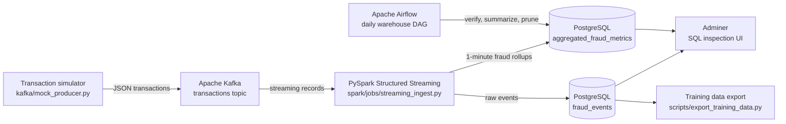
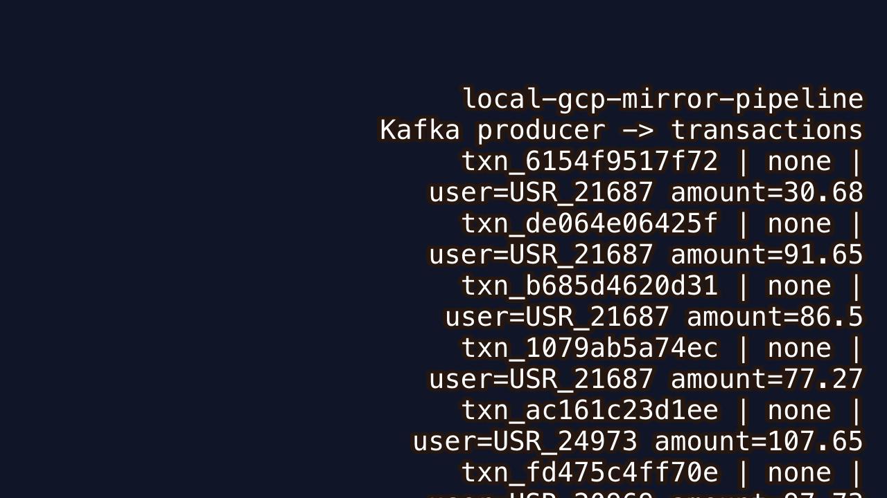
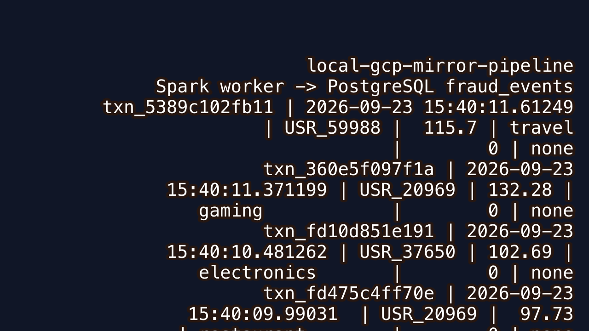
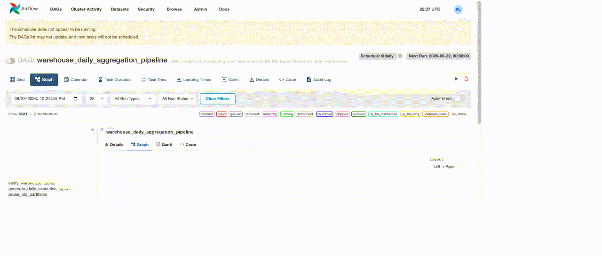
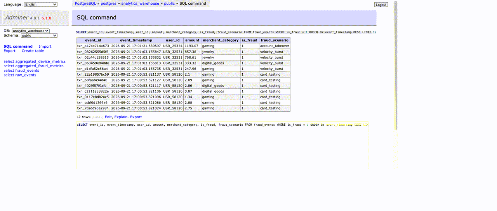

# Local Data Pipeline Platform (GCP Architecture Mirror)

This project functions as a local, zero-cost framework matching the core architectural paradigms tested on the Google Cloud Professional Data Engineer certification exam.

## Architecture Mapping
- **Ingestion:** Apache Kafka (Concept: **GCP Pub/Sub**)
- **Transformation:** Python / PySpark / Apache Beam (Concept: **GCP Dataflow / Dataproc**)
- **Orchestration:** Apache Airflow (Concept: **GCP Cloud Composer**)
- **Data Warehouse:** PostgreSQL (Concept: **GCP BigQuery / Cloud SQL**)

## Pipeline Flow

## Pipeline in Action

### Live Data Flow

 

## Getting Started
1. Run `docker-compose up -d` to launch the environment.
2. Access the Airflow UI at `http://localhost:8080` (Credentials: admin/admin).

Open your web browser and navigate to the Airflow UI at http://localhost:8080.Log in using the admin credentials you declared in your compose stack:Username: adminPassword: adminIn the top navigation bar, click on Admin ➡️ Connections.Click the + (blue plus sign) icon to add a new connection record, and use these exact fields:Connection Id: postgres_warehouseConnection Type: PostgresHost: postgres (This tells Airflow to use the internal Docker network route to talk to your database container directly)Database: analytics_warehouseLogin: pipeline_userPassword: pipeline_passwordPort: 5432Click Save

- Watermarking (.withWatermark): Watermarking drops data that arrives past your set threshold.
- Windowing (window(...)): You must understand the difference between Tumbling windows (non-overlapping fixed time segments) and Sliding windows (overlapping segments).
- Checkpointing (checkpointLocation): Crucial for GCP Dataflow reliability. It saves state metadata so the streaming job can instantly recover if a cluster crash occurs without losing data.